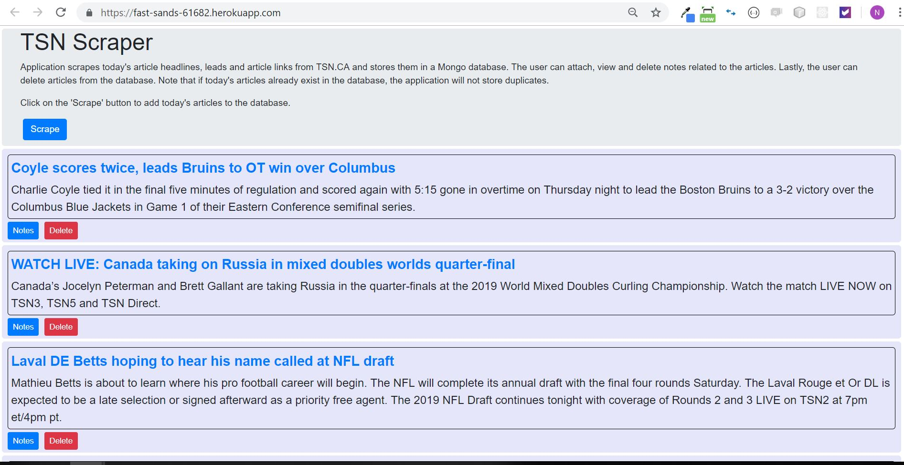
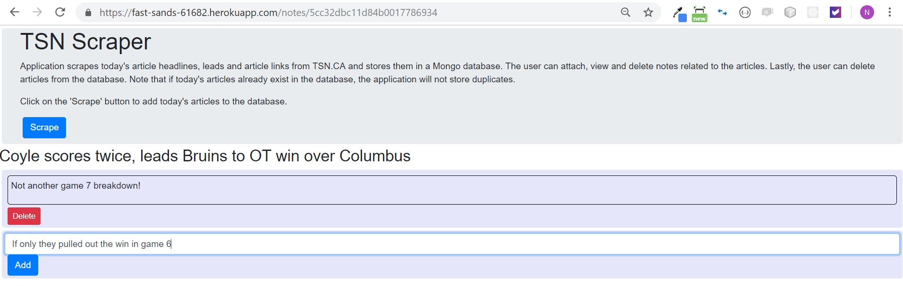

# TSN Scraper

- Scrapes today's article headlines, leads and article links from TSN.CA and stores them in a Mongo database. The user can attach, view and delete notes related to the articles. Lastly, the user can delete articles from the database. Note that if today's articles already exist in the database, the application will not store duplicates.

## Link

- https://fast-sands-61682.herokuapp.com/

## Technology

- Javascript, MongoDB, Cheerio, Handlebars, mongoose, mLab, Heroku

# Quick Tour

## Scrape

- Utilizes Cheerio for scraping headlines, leads and article links from TSN.CA

  

## Article notes

- Website visitors can add notes to scraped articles

  
